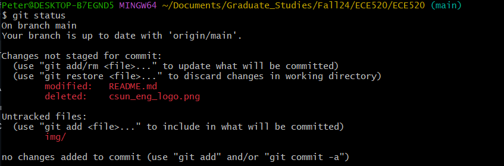

# CSUN ECE 520
## Gettin Started with Git
**Name: Peter Beal
Date: 08/26/2024**


1. FPGA
2. VHDL
3. Verilog


[Peter Beal](https://github.com/ThomSirveaux)

```vhdl

library ieee;
use ieee.std_logic_1164.all;
use ieee.std_logic_unsigned.all;

entity counter is
    port (
        clk : in std_logic;
        reset : in std_logic;
        enable : in std_logic;
        count : out std_logic_vector(3 downto 0)
    );
end counter;

architecture Behavioral of counter is
    signal pre_count : std_logic_vector(3 downto 0);
begin
    process (clk, enable, reset)
    begin
        if reset = '1' then
            pre_count <= "0000";
        elsif (clk = '1' and clk'event) then
            if enable = '1' then
                pre_count <= pre_count + "1";
            end if;
        end if;
    end process;
    count <= pre_count;
end Behavioral;
```

